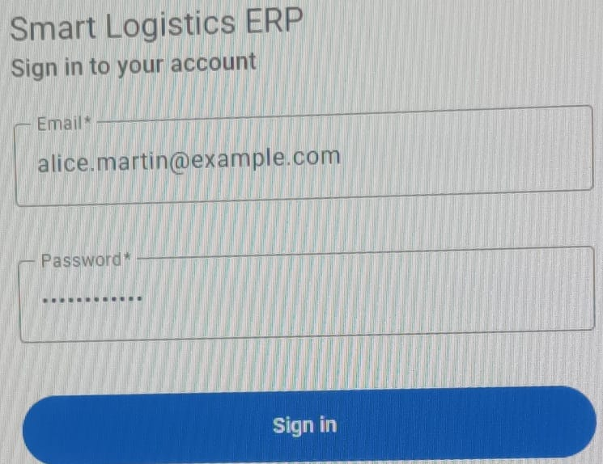
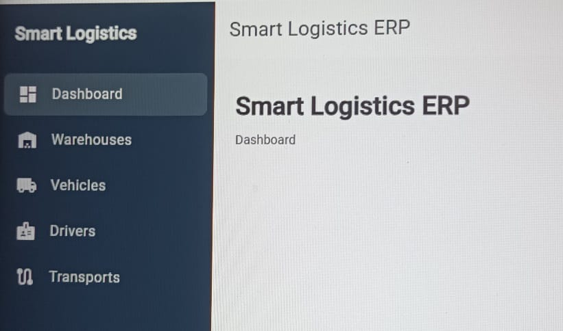
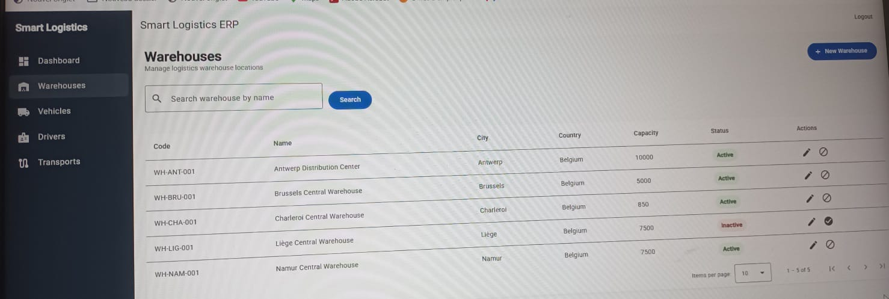
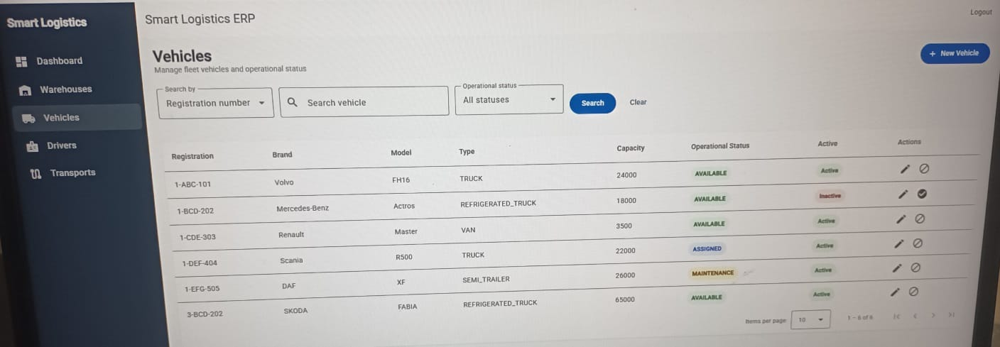
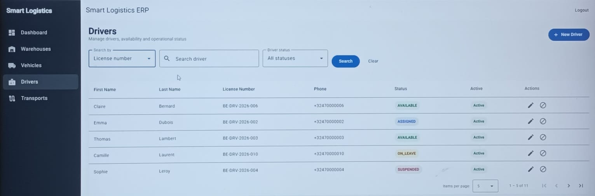
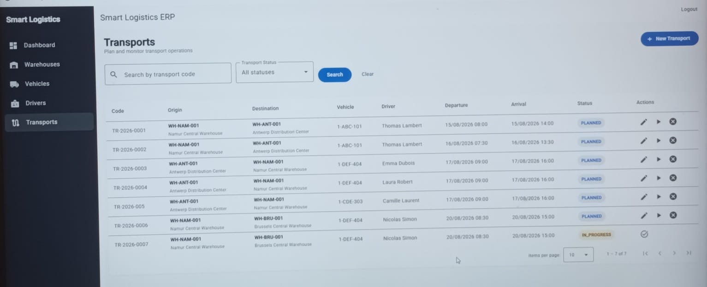

# Smart Logistics & Transport ERP

> A full-stack logistics management platform combining software engineering
> with real-world transport and logistics business processes.

Smart Logistics & Transport ERP is a full-stack enterprise application designed
to manage core logistics and transport operations, including warehouses,
vehicles, drivers and transport planning.

The project is built as a professional portfolio project and reflects my dual
background in **Computer Science / Application Development** and
**Transport & Logistics**.

Rather than implementing independent CRUD modules, the application models
connected business processes with authentication, role-based authorization,
resource availability, operational statuses and transport lifecycle rules.

---

## Project Overview

The objective of this project is to design and progressively build a
modular logistics ERP covering operational processes commonly found in
transport, warehousing and supply-chain environments.

The current version implements:

- Authentication and JWT security
- Role-Based Access Control (RBAC)
- User and role management
- Warehouse management
- Vehicle / fleet management
- Driver management
- Transport planning and lifecycle management
- Operational dashboard
- Search, filtering and pagination
- Business-rule validation
- Centralized exception handling

The project is under active development and additional supply-chain modules
are planned.

---

## Why This Project?

Logistics software is not only about storing data.

Real transport operations involve dependencies between warehouses, vehicles,
drivers, schedules and operational statuses.

This project demonstrates how these business constraints can be translated
into a full-stack application.

For example, creating and executing a transport operation requires:

1. an origin warehouse;
2. a different destination warehouse;
3. an active and available vehicle;
4. an active and available driver;
5. valid planned departure and arrival times;
6. controlled transport status transitions.

The objective is therefore to demonstrate both **software engineering skills**
and **understanding of logistics operations**.

---

## Architecture

The application follows a layered full-stack architecture.

```text
┌───────────────────────────────────────┐
│            Angular Frontend           │
│                                       │
│ Components • Services • Guards        │
│ Interceptors • Reactive Forms         │
└──────────────────┬────────────────────┘
                   │
                   │ REST / JSON
                   │ JWT
                   ▼
┌───────────────────────────────────────┐
│          Spring Boot REST API         │
│                                       │
│ Controllers • DTOs • Validation       │
│ Security • Exception Handling         │
└──────────────────┬────────────────────┘
                   │
                   ▼
┌───────────────────────────────────────┐
│            Service Layer              │
│                                       │
│ Business Rules • Transactions         │
│ Resource Validation                   │
└──────────────────┬────────────────────┘
                   │
                   ▼
┌───────────────────────────────────────┐
│          Persistence Layer            │
│                                       │
│ Spring Data JPA • Hibernate           │
└──────────────────┬────────────────────┘
                   │
                   ▼
┌───────────────────────────────────────┐
│              PostgreSQL               │
└───────────────────────────────────────┘
```
## Implemented Modules
### Administration & Security
The administration layer provides the security foundation of the ERP.
Implemented features include:
- JWT authentication
- Role-Based Access Control (RBAC)
- User management
- Role management
- Protected REST endpoints
- Angular route guards
- HTTP authentication interceptor
- Role-aware frontend actions

### Roles

The application currently supports the following roles:

| Role | Main Responsibility |
|---|---|
| `ADMIN` | Full administrative and operational access |
| `MANAGER` | Read access to operational resources |
| `WAREHOUSE_OFFICER` | Warehouse-related operations |
| `TRANSPORT_COORDINATOR` | Vehicle, driver and transport operations |

Authorization is enforced at API level by Spring Security and reflected
in the Angular interface.
# Smart Logistics & Transport ERP
Smart Logistics & Transport ERP is a full-stack enterprise application inspired by real-world logistics, transport, warehouse and supply chain operations.

The project is designed as a professional portfolio project to demonstrate backend architecture, security, business-rule implementation, database design and full-stack development using Spring Boot, Angular and PostgreSQL.
## Business Domain
The application models business processes commonly found in:
- Logistics
- Transport
- Supply Chain
- Warehouse Management
- Cargo Operations
- Import & Export
## Current Backend Features
The current backend includes:
- JWT Authentication
- Role-Based Access Control (RBAC)
- User Management
- Role Management
- Warehouse Management
- Vehicle Management
- Driver Management
- Transport Management
- Pagination
- Search and filtering
- Business rule validation
- Centralized exception handling
- Database migrations with Flyway
- DTO mapping with MapStruct
- Audit fields with reusable JPA base entity
## Implemented Roles
Current roles include:
- ADMIN
- MANAGER
- WAREHOUSE_OFFICER
- TRANSPORT_COORDINATOR
Authorization rules are centralized and applied at API level.

Examples:
- ADMIN can manage users and roles.
- MANAGER has read access to operational resources.
- WAREHOUSE_OFFICER has warehouse-specific access.
- TRANSPORT_COORDINATOR manages vehicles, drivers and transports.
## Implemented Modules
### Administration
- User
- Role
- Authentication
- Authorization
### Warehouse Management
- Warehouse creation and update
- Pagination
- Search
- Activation / deactivation
### Fleet Management
- Vehicle creation and update
- Vehicle types
- Operational vehicle status
- Activation / deactivation
- Pagination and search
### Driver Management
- Driver creation and update
- Driver operational status
- License-number uniqueness
- Activation / deactivation
- Pagination and search
### Transport Management
Transport operations link:
- Origin warehouse
- Destination warehouse
- Vehicle
- Driver
### Business rules include:
- origin and destination must be different;
- warehouses must be active;
- vehicle must be active and available;
- driver must be active and available;
- planned departure must be before planned arrival;
- status transitions are controlled by dedicated operations.
## Planned Modules
### The following modules are planned for future iterations:
- Customer Management
- Supplier Management
- Carrier Management
- Product Management
- Inventory Management
- Purchase Orders
- Cargo & Shipment Management
- Delivery Management
- Reporting
- KPI Dashboard
## Tech Stack
### Backend
- Java 21
- Spring Boot 3.5.16
- Spring Security (JWT)
- Spring Data JPA
- Hibernate
- PostgreSQL
- Jakarta Validation
- MapStruct
- Lombok
- Flyway
- Swagger/OpenAPI
- Maven
### Frontend
- Angular 22
- TypeScript
- Angular Material
- RxJS
- Reactive Forms
- Angular Router
### Testing
- JUnit 5
- Mockito
- Spring Boot Test
- Testcontainers (PostgreSQL integration testing)
Unit tests are being added progressively for service-layer business logic.
Planned later:
- Integration testing
- PostgreSQL Testcontainers
- Security / RBAC integration tests
### DevOps & Tools
- Docker & Docker Compose
- Git & GitHub
- GitHub Actions(CI/CD ready)
- Postman  (API testing)
## Project Status
- ✅ Functional Analysis & Business Rules
- ✅ Database Design
- 🟢 Backend Core Development
- ✅ Authentication & JWT Security
- ✅ Role-Based Authorization
- ✅ User / Role Management
- ✅ Warehouse Backend
- ✅ Vehicle Backend
- ✅ Driver Backend
- ✅ Transport Backend
- 🟡 Frontend Development
- 🟡 Testing
- ⬜ Dockerization
- ⬜ CI/CD
- ⬜ Deployment
  
## Screenshots
### Screenshots will be added during frontend development.
### Authentication



### Dashboard



### Warehouse Management



### Vehicle Management



### Driver Management



### Transport Management



## Future Improvements
- Barcode / QR Code support
- Email Notifications
- Google Maps integration
- Audit Logs
- Multi-language support
- Mobile-friendly interface
- Advanced Reporting
- CI/CD
- Docker Compose
- Cloud Deployment
## About the Author
Bachelor in Computer Science (Application Development) with a background in Transport & Logistics. Passionate about designing enterprise applications and applying software engineering best practices to logistics, transport and supply chain management.
