# Smart Logistics & Transport ERP

A full-stack logistics management platform combining software engineering with real-world transport and logistics business processes.

Smart Logistics & Transport ERP is a full-stack enterprise application designed
to manage core logistics and transport operations, including warehouses,
vehicles, drivers, transport planning and business modules.

The project is built as a professional portfolio project and reflects my dual
background in **Computer Science / Application Development** and
**Transport & Logistics**.
Rather than implementing independent CRUD modules, the application models
connected business processes with authentication, role-based authorization,
resource availability, operational statuses and transport lifecycle rules.

---

## Project Overview

The objective of this project is to design and progressively build a
modular logistics ERP covering operational processes commonly found in
transport, warehousing, Cargo Operations, Import & Export and supply-chain environments.

The current version implements:

- Authentication and JWT security
- Role-Based Access Control (RBAC)
- User and role management
- Operational dashboard
- Warehouse management
- Vehicle / fleet management
- Driver management
- Transport planning and lifecycle management
- Business Partners Management
- Product & Inventory Management
- Search, filtering and pagination
- Business-rule validation
- Centralized exception handling

The project is under active development and additional supply-chain modules
are planned.

---

## Why This Project?

Logistics software is not only about storing data.

Real transport operations involve dependencies between warehouses, vehicles,
drivers, schedules and operational statuses.

This project demonstrates how these business constraints can be translated
into a full-stack application.

For example, creating and executing a transport operation requires:

1. an origin warehouse;
2. a different destination warehouse;
3. an active and available vehicle;
4. an active and available driver;
5. valid planned departure and arrival times;
6. controlled transport status transitions.

The objective is therefore to demonstrate both **software engineering skills**
and **understanding of logistics operations**.

---

## Architecture

The application follows a layered full-stack architecture.

```text
┌───────────────────────────────────────┐
│            Angular Frontend           │
│                                       │
│ Components • Services • Guards        │
│ Interceptors • Reactive Forms         │
└──────────────────┬────────────────────┘
                   │
                   │ REST / JSON
                   │ JWT
                   ▼
┌───────────────────────────────────────┐
│          Spring Boot REST API         │
│                                       │
│ Controllers • DTOs • Validation       │
│ Security • Exception Handling         │
└──────────────────┬────────────────────┘
                   │
                   ▼
┌───────────────────────────────────────┐
│            Service Layer              │
│                                       │
│ Business Rules • Transactions         │
│ Resource Validation                   │
└──────────────────┬────────────────────┘
                   │
                   ▼
┌───────────────────────────────────────┐
│          Persistence Layer            │
│                                       │
│ Spring Data JPA • Hibernate           │
└──────────────────┬────────────────────┘
                   │
                   ▼
┌───────────────────────────────────────┐
│              PostgreSQL               │
└───────────────────────────────────────┘
```
## Implemented Modules
### Administration & Security

The application uses JWT-based authentication and Spring Security.
The security architecture includes:
- JWT authentication
- Stateless API security
- Password-based authentication
- Role-Based Access Control (RBAC)
- Backend endpoint authorization
- Angular authentication guards
- Angular role guards
- HTTP authentication interceptor

Authorization rules are enforced on the backend. 
Frontend role checks improve the user experience but are not considered the security boundary.

### Roles

The application currently supports the following roles:

| Role | Main Responsibility |
|---|---|
| `ADMIN` | Full administrative and operational access |
| `MANAGER` | Read access to operational resources |
| `WAREHOUSE_OFFICER` | Warehouse-related operations |
| `TRANSPORT_COORDINATOR` | Vehicle, driver and transport operations |

Authorization is enforced at API level by Spring Security and reflected
in the Angular interface.
### Authentication

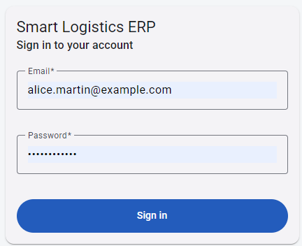

### Operational Dashboard

The dashboard provides a consolidated overview of logistics operations.
Current KPIs include:
- Total warehouses
- Available vehicles
- Available drivers
- Planned transports
- Transports in progress
- Completed transports

The dashboard also displays recent transport operations including their
origin, destination, assigned vehicle, driver, departure time and status.

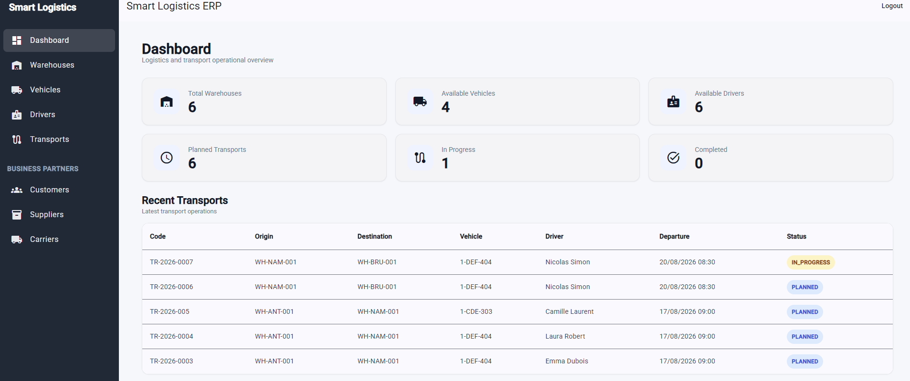

### Warehouse Management
The warehouse module manages logistics locations used by transport operations.

Features include:
- Warehouse creation
- Warehouse update
- Search by warehouse name
- Pagination
- Capacity management
- Activation / deactivation
- Role-based access
  
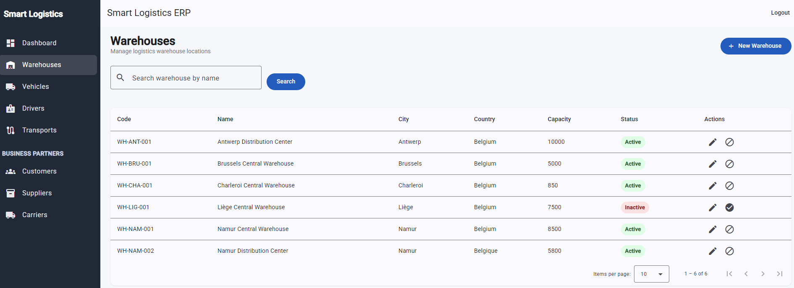

### Fleet Management

The fleet module manages vehicles used for transport operations.

Features include:
- Vehicle creation and update
- Registration-number uniqueness
- Search by registration number
- Search by brand
- Filtering by operational status
- Pagination
- Activation / deactivation

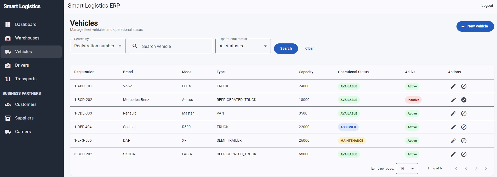

### Driver Management

The driver module manages drivers and their operational availability.

Features include:

- Driver creation and update
- License-number uniqueness
- Search by license number
- Search by last name
- Status filtering
- Driver Statuses
- Pagination
- Activation / deactivation

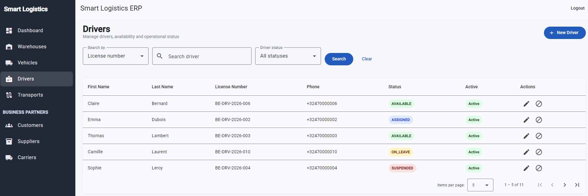

### Transport Management

Transport Management connects the main operational resources of the ERP.

Each transport references:
- Origin warehouse
- Destination warehouse
- Vehicle
- Driver
- Planned departure
- Planned arrival
- Actual departure
- Actual arrival
- Operational status

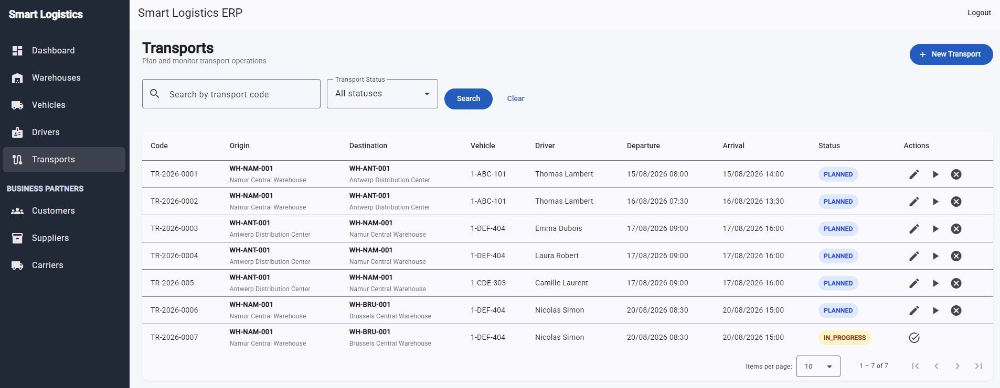

#### Transport Lifecycle
```text
                 ┌───────────┐
                 │  PLANNED  │
                 └─────┬─────┘
                       │
                Start transport
                       │
                       ▼
                ┌─────────────┐
                │ IN_PROGRESS │
                └──────┬──────┘
                       │
               Complete transport
                       │
                       ▼
                 ┌───────────┐
                 │ COMPLETED │
                 └───────────┘
PLANNED ───────────────► CANCELLED
```
### Business Rules

Transport operations enforce rules including:
- Origin and destination warehouses must be different
- Warehouses must be active
- Vehicle must be active and available
- Driver must be active and available
- Planned departure must occur before planned arrival
- Transport status transitions are controlled
- Transport execution updates operational resource availability

## Cross-Module Business Workflow

One of the main objectives of this project is to model relationships between
business modules rather than implementing isolated CRUD operations.

```text
                   ┌─────────────────┐
                   │    Transport    │
                   └────────┬────────┘
                            │
          ┌─────────────────┼─────────────────┐
          │                 │                 │
          ▼                 ▼                 ▼
     Warehouses          Vehicle           Driver
          │                 │                 │
          │                 │                 │
     Origin /          Availability      Availability
    Destination          & Status          & Status
          │                 │                 │
          └─────────────────┼─────────────────┘
                            │
                            ▼
                  Transport Lifecycle
                            │
                  ┌─────────┴─────────┐
                  ▼                   ▼
             COMPLETED            CANCELLED
```
This architecture allows business rules from multiple logistics domains to participate in the same operational workflow.

## Business Partners Management

The Business Partners module centralizes the external organizations involved in logistics and transport operations.

### Customers
- Customer creation and update
- Customer activation/deactivation
- Search by customer code and company name
- Pagination
- Role-based access control
  
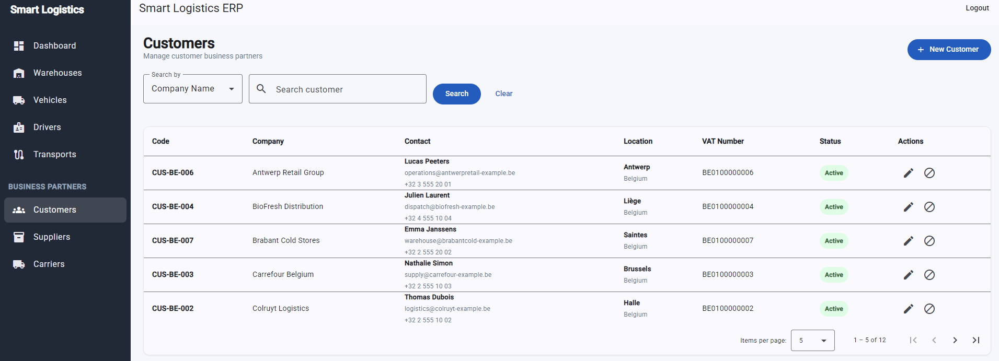

### Suppliers
- Supplier creation and update
- Supplier activation/deactivation
- Search by supplier code and company name
- Pagination
- Role-based access control
  
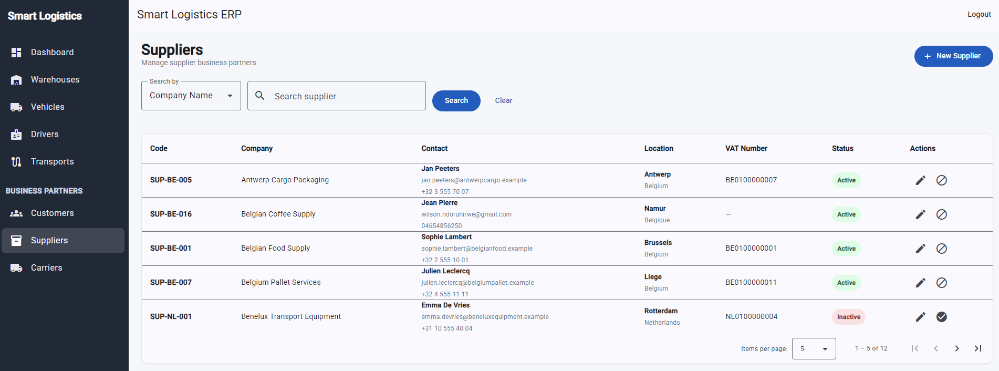

### Carriers
- External carrier creation and update
- Carrier activation/deactivation
- Transport license management
- Search by carrier code, company name and license number
- Pagination
- Role-based access control
  
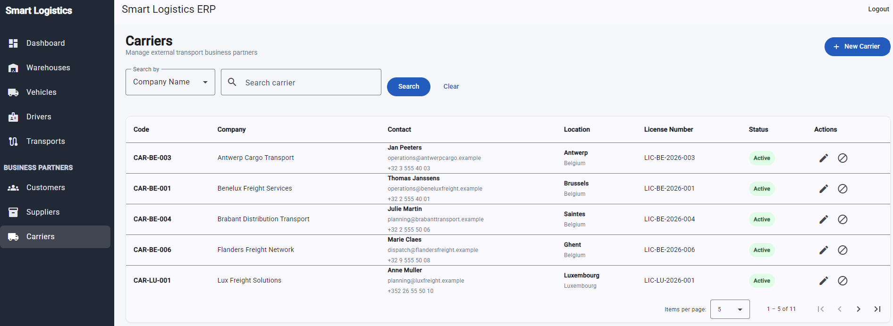

Business Partner operations are secured using JWT authentication and role-based permissions for administrative and management users.

## 📦 Product & Inventory Management

A complete inventory management module designed around real-world logistics and warehouse operations, with a strong focus on **stock traceability, business rules, and data consistency**.

### Product Catalog Management

- Product category management
- Product master data with unique SKU identification
- Product classification by category
- Multiple units of measure
- Decimal quantities for weight, volume, length, and piece-based products
- Product activation / deactivation lifecycle
- Search and filtering by SKU, name, and category
- Role-based access to management operations

### Multi-Warehouse Inventory

- Inventory tracking by **Product × Warehouse**
- Physical stock quantity tracking
- Reserved quantity management
- Automatic available stock calculation
- Configurable minimum stock levels
- Automatic **Low Stock** detection
- Inventory filtering by product and warehouse
- Operational stock overview across warehouses

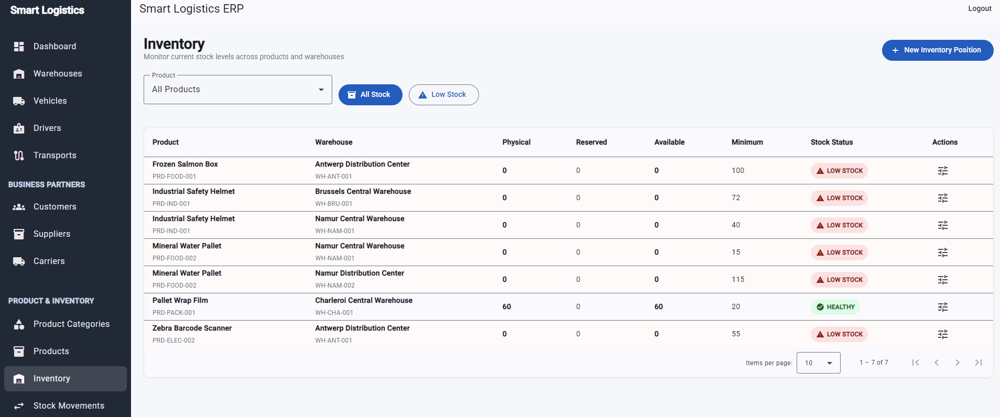

### Stock Movement & Traceability

Inventory quantities are not directly edited after initialization.

Every physical stock change is recorded through an immutable stock movement:

- `STOCK_IN` — incoming inventory
- `STOCK_OUT` — outgoing inventory
- `ADJUSTMENT_IN` — positive inventory correction
- `ADJUSTMENT_OUT` — negative inventory correction

Each movement keeps operational information such as:

- Product
- Warehouse
- Movement type
- Decimal quantity
- Business reference
- Reason / notes
- Movement date
- User responsible for the operation

This approach provides a clear **audit trail** and prevents uncontrolled manual modification of inventory quantities.

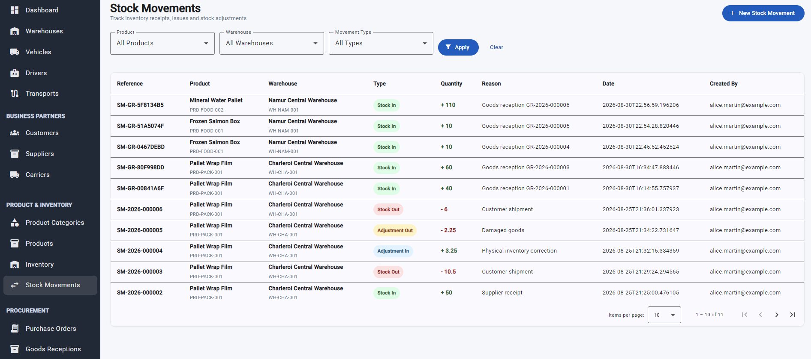

### Business Rules

The module enforces key inventory rules at the backend level:

- Stock quantities cannot become negative
- Reserved quantities cannot exceed physical stock
- Outgoing movements are validated against available inventory
- Product and warehouse relationships are validated before stock operations
- Duplicate inventory positions for the same Product × Warehouse combination are prevented
- Inventory adjustments require explicit business justification
- Product activation/deactivation is separated from master-data updates
- Stock corrections are performed through movements rather than rewriting historical inventory data

Read and write permissions are enforced by the backend and reflected in the Angular user interface.

### Architecture

```text
Product Category
       │
       ▼
    Product
       │
       ▼
Inventory Position ◄──── Warehouse
       │
       ▼
 Stock Movement
       │
       ├── STOCK_IN
       ├── STOCK_OUT
       ├── ADJUSTMENT_IN
       └── ADJUSTMENT_OUT
```

## Planned Business Modules

### Procurement
- Purchase Order Management
- Supplier orders
- Goods reception
### Cargo & Shipment
- Cargo Management
- Shipment Management
- Cargo-to-transport assignment
- Shipment tracking
### Delivery
- Delivery Management
- Delivery status tracking
- Proof-of-delivery workflow
### Reporting & Analytics
- Operational reports
- Historical transport analysis
- Fleet utilization
- Warehouse activity
- Driver activity
- Advanced KPI dashboards

## Future Technical Improvements
Planned technical improvements include:
- Docker / Docker Compose
- CI/CD pipeline
- Cloud deployment
- Expanded integration testing
- Security integration tests
- Audit logging
- Email notifications
- Barcode / QR code support
- Advanced reporting
- Mobile-friendly interface
- Multi-language support
- Mapping / geolocation integration
  
## Tech Stack
### Backend
- Java 21
- Spring Boot 3.5.16
- Spring Security (JWT)
- Spring Data JPA
- Hibernate
- PostgreSQL
- Jakarta Validation
- MapStruct
- Lombok
- Flyway
- Swagger/OpenAPI
- Maven
### Frontend
- Angular 22
- TypeScript
- Angular Material
- RxJS
- Reactive Forms
- Angular Router
- HTTP Interceptors
- Route Guards
### Testing
- JUnit 5
- Mockito
- Spring Boot Test
- Testcontainers
- PostgreSQL integration testing
Testing is being expanded progressively to cover service-layer business
rules, integration scenarios and security behavior.
### DevOps & Tools
- Docker & Docker Compose
- Git & GitHub
- GitHub Actions(CI/CD ready)
- Postman  (API testing)
- IntelliJ IDEA
- Visual Studio Code

## Project Structure
```text
smart-logistics-transport-erp/
│
├── backend/
│   └── src/
│       ├── main/
│       │   ├── java/
│       │   │   └── com/ndoruhirwe/smartlogistics/
│       │   │       ├── config/
│       │   │       ├── controller/
│       │   │       ├── dto/
│       │   │       ├── entity/
│       │   │       ├── exception/
│       │   │       ├── mapper/
│       │   │       ├── repository/
│       │   │       ├── security/
│       │   │       └── service/
│       │   │
│       │   └── resources/
│       │       └── db/migration/
│       │
│       └── test/
│
├── frontend/
│   └── src/
│       └── app/
│           ├── core/
│           │   ├── auth/
│           │   ├── guards/
│           │   ├── interceptors/
│           │   ├── models/
│           │   └── services/
│           │
│           ├── features/
│           │   ├── auth/
│           │   ├── dashboard/
│           │   ├── warehouses/
│           │   ├── vehicles/
│           │   ├── drivers/
│           │   └── transports/
│           │
│           └── layout/
│
├── docs/
│   └── screenshots/
│
└── README.md
```
## Getting Started
### Prerequisites
Install:
- Java 21
- Maven
- Node.js
- Angular CLI
- PostgreSQL

## Database Migrations

Database schema changes are managed with Flyway.

Migration scripts are versioned with the application to provide reproducible
database evolution across environments.

## Professional Context
This project reflects the combination of two areas of my academic background:

Recently graduated (Bachelor) with distinction in Computer Science – Applications Development
Haute École de Namur-Liège-Luxembourg (Hénallux), Belgium
2022–2026

Diploma in Transport & Logistics
EAFC Namur-Cadets, Belgium
2020–2021

My objective is to apply software engineering to real operational and business
problems, particularly in logistics, transport, supply chain and enterprise
information systems.

This dual background helps me approach logistics software from both perspectives:

- understanding the technical architecture required to build reliable software;
- understanding the operational processes the software is intended to support.

## Skills Demonstrated by This Project
### Software Engineering
- Object-oriented programming
- REST API design
- Full-stack application development
- Layered architecture
- Relational database design
- Authentication and authorization
- Business-rule implementation
- Exception handling
- DTO mapping
- Form validation
- Frontend state and API integration
- Git-based development workflow

### Logistics & Business Domain
- Warehouse operations
- Fleet management
- Driver management
- Transport planning
- Resource allocation
- Operational availability
- Transport lifecycle management
- Logistics process modeling
- Supply-chain ERP concepts

## About the Developer
Computer Science graduate in Applications Development with an additional
academic background in Transport & Logistics.

Interested in opportunities where software engineering, enterprise applications,
logistics, transport and supply-chain operations intersect.

This project was created to demonstrate my ability to transform real business
requirements into a structured full-stack software solution.
